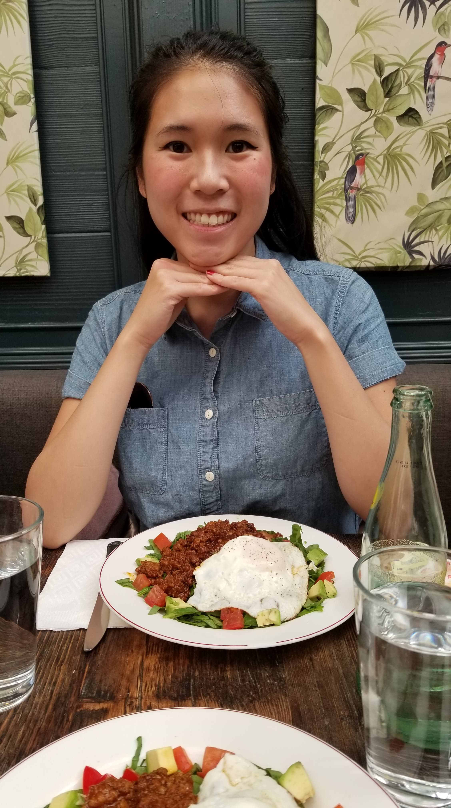

Its finally over. The last day of Grace Hopper was today and I'm done. It ended early, I've said my goodbyes, and I am so very proud to have finished. For the last 17 weeks, I have swam against an impossible current. It pulled me down under its strength. At times, I couldn't breathe and dread consumed me. Yet, against, or maybe in spite of myself, I pulled myself out of the current and swam to shore.

I am eager to go to down to Florida for a week. To turn off my laptop and exchange it for sun, feeling the warmness fill my soul. I want to feel the foamy waves lap over my toes. I want to walk through the gates of Disney, as I have for 24 years, to let the magic imbue me. To eat enough fried chicken livers to last me until my next trip.

Now the real work begins. The hunt for the ever elusive job.

I know the road will not be easy. That there will be moments of doubt, second guessing, and rejection. It will test me and there will be struggles ahead. But when had I ever done something that was easy?

If this program has taught me anything, its that I am smarter, sharper than I give myself credit for. I can pick up foreign technologies at an alarming rate. I can grow from seemingly impossible problems and learn to solve them. I have an astonishing amount of willpower. Mostly, I believe in myself. I am, and have always been, extremely hard on myself. Because I know I can be better. I can always be better.
